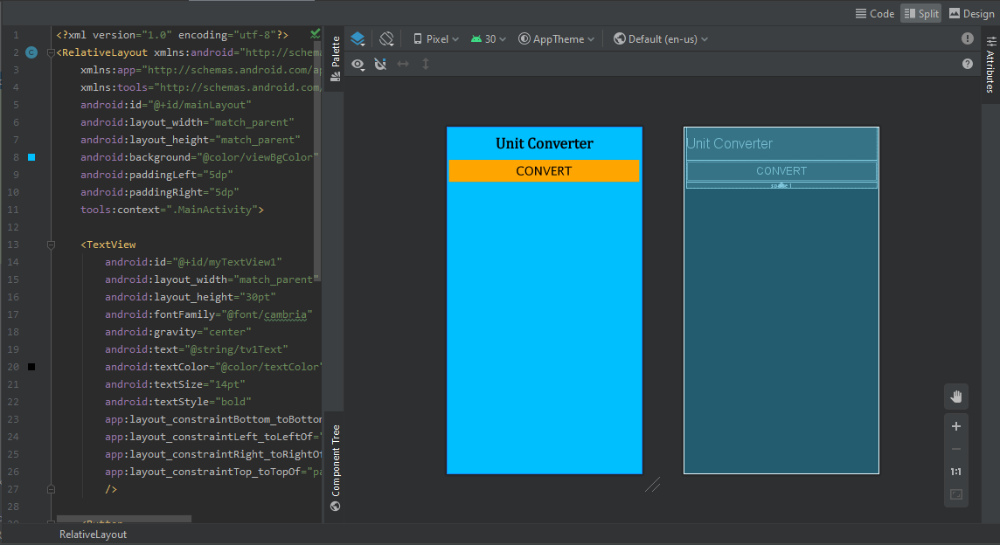
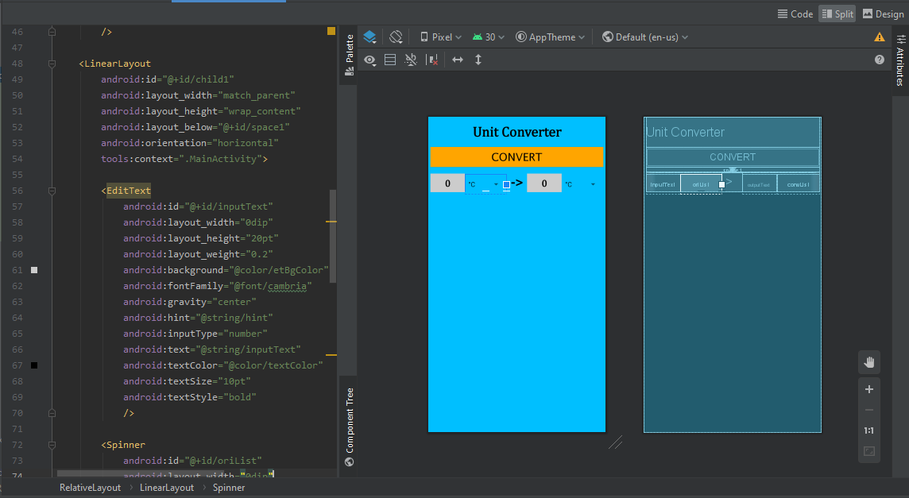
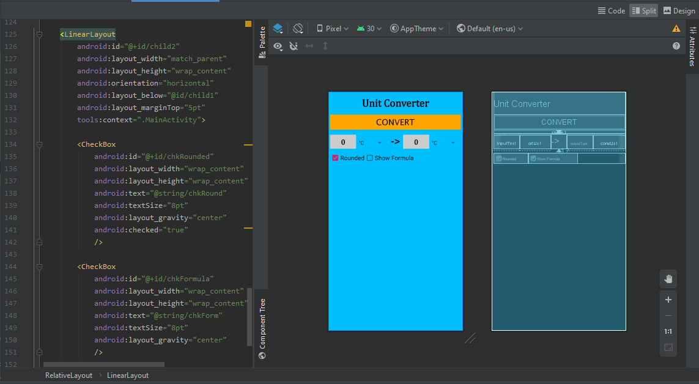
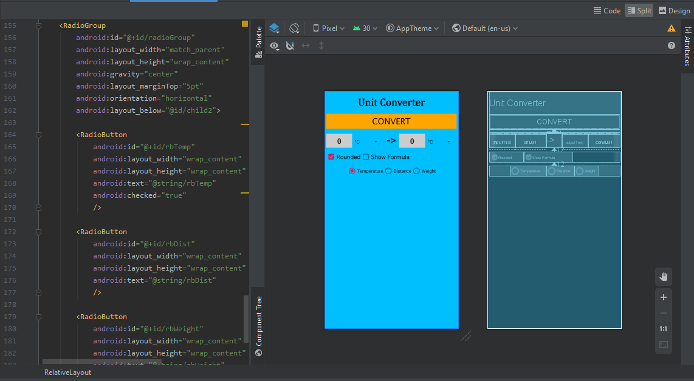
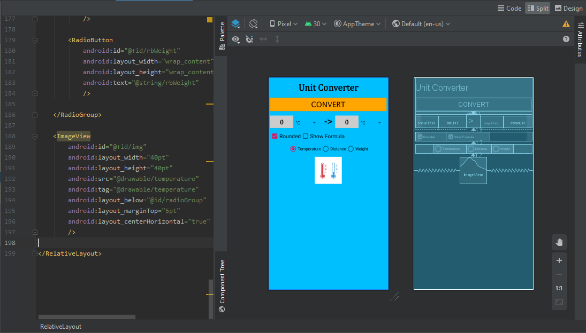
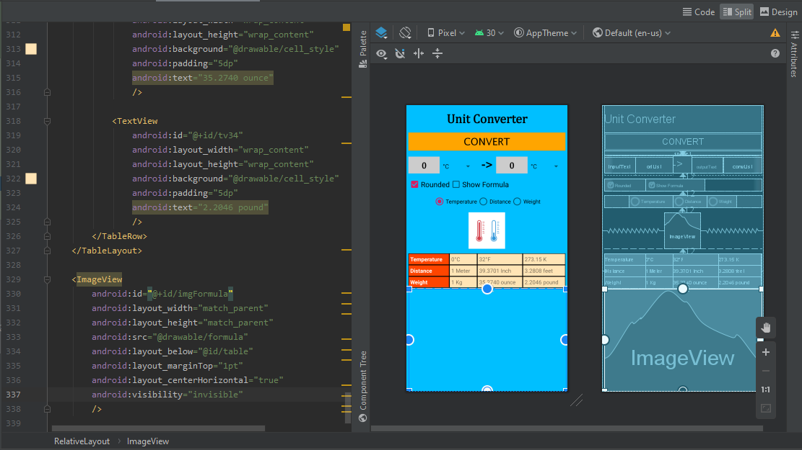

# Dasar Layout 

## Objektif

1. Mengerti cara membuat Android Studio Project menggunakan blank layout.
2. Mengerti cara mengkonfigurasi Android Studio project resources, seperti string dan font.
3. Mengerti cara mendesain basic layout, menambahkan TextView, dan menambahkan a Button.
4. Students know how to make Space and add Child Layout.
5. Mengerti cara mengkonfigurasi color resources, membuat EditText, dan Spinner.
6. Mengerti cara membuat CheckBox.
7. Mengerti cara membuat RadioGroup dan RadioButton.
8. Mengerti cara menambahkan image resource dan membuat ImageView.
9. Mengerti cara menambahkan drawable resource dan membuat Table.

## Deskripsi

Topik ini berisi beberapa materi pelajaran termasuk properti proyek, desain tata letak menggunakan XML dan definisi serta pengelolaan sumber daya seperti drawable, warna, string, dan gaya. Ini adalah langkah penting dalam mempelajari Android, di mana pengguna akan mulai membuat aplikasi Android dengan mendesain antarmuka dengan XML.

## Laporan Praktikum

1. 

.PNG)

2. 

.PNG)

3. 
Desain:

Hasil Pengujian:
.PNG)

4. 

.PNG)

5. 
Desain:

Hasil Pengujian:
.PNG)

6. 
Desain:

Hasil Pengujian:
.PNG)

7. 
Desain:

Hasil Pengujian:
.PNG)

8. 
Desain:

Hasil Pengujian:
.PNG)
.PNG)

9. 
Desain:

Hasil Pengujian:
.PNG)
.PNG)

## Pernyataan Diri

Saya menyatakan isi tugas, kode program, dan laporan praktikum ini dibuat oleh saya sendiri. Saya tidak melakukan plagiasi, kecurangan, menyalin/menggandakan milik orang lain.

Jika saya melakukan plagiasi, kecurangan, atau melanggar hak kekayaan intelektual, saya siap untuk mendapat sanksi atau hukuman sesuai peraturan perundang-undangan yang berlaku.

Ttd,

***(Abdulloh)***
