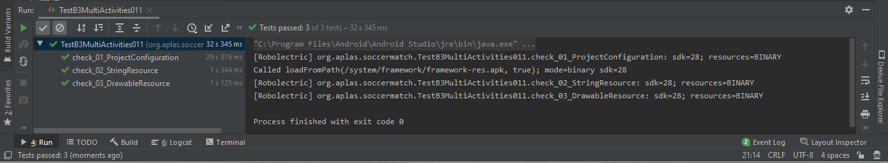
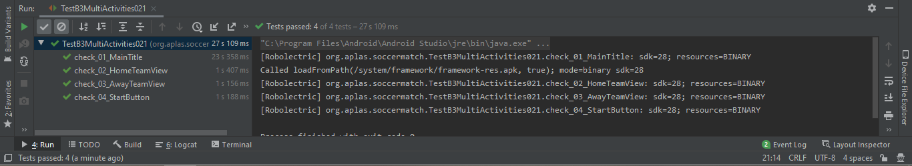
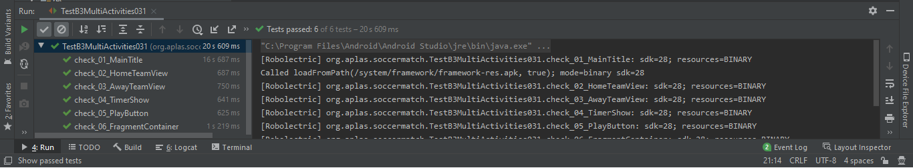
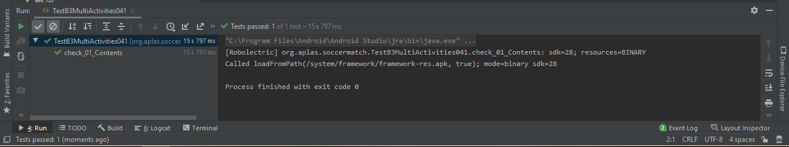
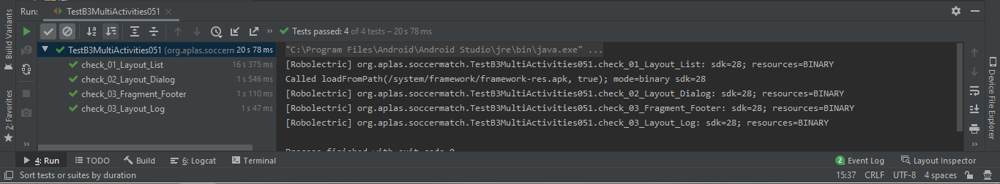
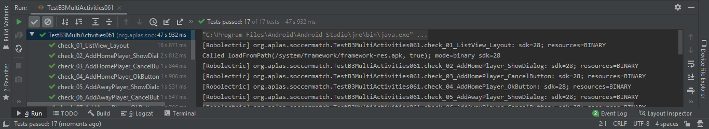
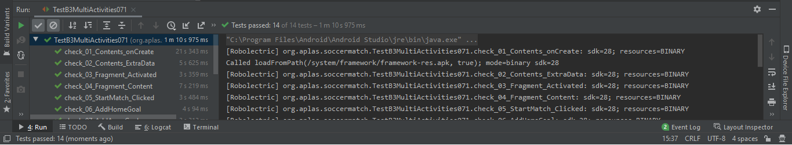
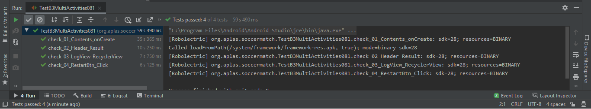

# Advanced Widgets

## Objektif

## Deskripsi

## Laporan Praktikum

1. Hasil output 

2. Hasil output 

3. Hasil output 

4. Hasil output 

5. Hasil output 

6. Hasil output 

7. Hasil output 

8. Hasil output 

## Hasil Akhir

## Pernyataan Diri

Saya menyatakan isi tugas, kode program, dan laporan praktikum ini dibuat oleh saya sendiri. Saya tidak melakukan plagiasi, kecurangan, menyalin/menggandakan milik orang lain.

Jika saya melakukan plagiasi, kecurangan, atau melanggar hak kekayaan intelektual, saya siap untuk mendapat sanksi atau hukuman sesuai peraturan perundang-undangan yang berlaku.

Ttd,

***(Abdulloh)***
