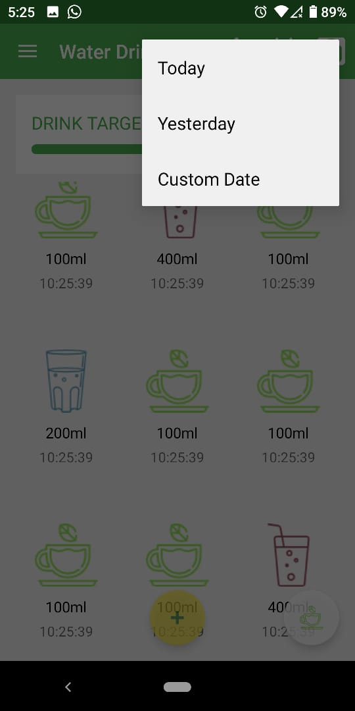
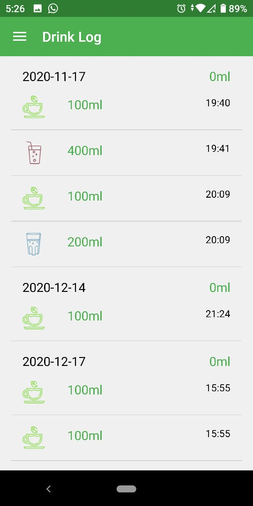
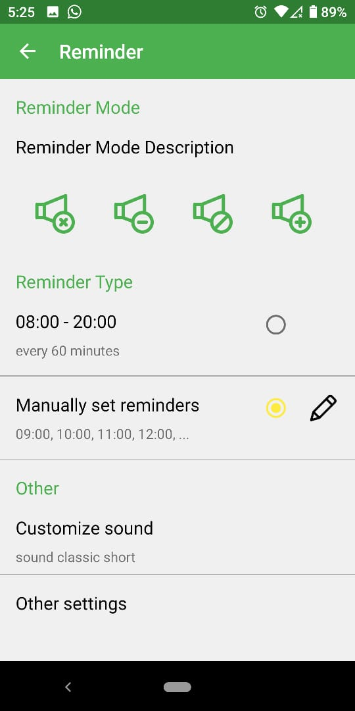
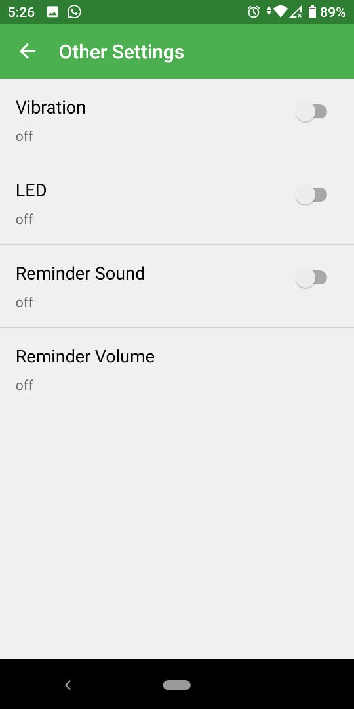
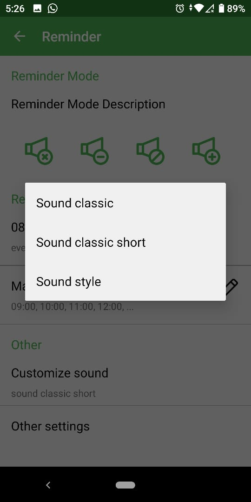
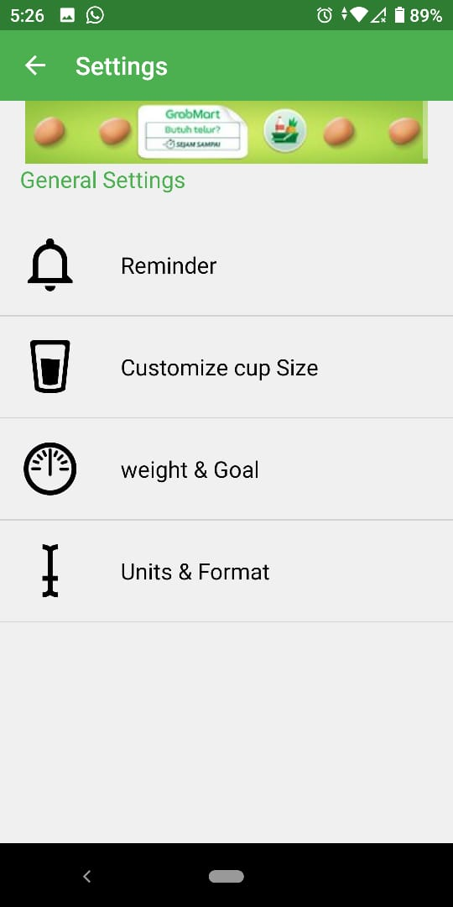

# Laporan Project Akhir (Tugas Besar)

## Judul 
Water Drink Reminder, menggunakan Android Studio dengan bahasa kotlin ( [Source Code Disini](https://github.com/abdullohn/Mobile-3D-01/tree/gh-pages/src/13_Projek) )

## Deskripsi
Tujuan utama aplikasi ini ialah merancang dan membuat pengembangan aplikasi untuk mengetahui pola hidup
sehat, Aplikasi ini dibuat sesuai dengan judulnya yang berartikan pengingat untuk minum air. Jadi pengguna aplikasi ini diharapkan akan menjadi lebih perhatian dengan menggunakan aplikasi ini karena diingatkan melalui notifikasi kapan waktu untuk meminum air, juga bisa melihat riwayat harian kapan minum air, fungsi lainnya yaitu bisa ditentukan target minum air dalam sehari.

## Identitas Pengembang (Developer)
<table>
 <tbody>
  <tr>
   <td>Nama</td><td>Abdulloh</td></td>
  </tr>
  <tr>
   <td>Institusi</td><td>Politeknik Negeri Malang</td></td>
  </tr>
  <tr>
   <td>Semester</td><td>5 (Lima)</td></td>
  </tr>
  <tr>
   <td>Tahun Ajar</td><td>2020/2021</td></td>
  </tr>
  <tr>
   <td>NIM</td><td>1841720209</td></td>
  </tr>
   <tr>
   <td>Kelas/Absen</td><td>TI-3D/01</td></td>
  </tr>
 </tbody>
</table>

## Fitur-fitur 
Berikut fitur-fitur pada aplikasi Water Drink Reminder (Untuk Screenshot yang lebih detail [[Screennshot Disini](https://https://github.com/abdullohn/Mobile-3D-01/tree/gh-pages/docs/13_Projek/img)] )

1. Halaman Home : Ketika aplikasi dibuka akan langsung muncul seperti pada gif dibawah ini

Home.gif)

2. Mililiter Button : Dibagian kanan bawah ada button yang berlogo cangkir kopi apabila dipilih tombol itu maka user bisa milih berapa mililiter yang mereka minum

Mililiter.gif)

3. Add Button : Dibagian bawah ada pula button berlogo plus bersebelahan dengan Mililiter Button berfungsi untuk menambah berapa Mililiter yang sudah diminum oleh user

Add.gif)

4. Calender : Difitur kalender ini sebenarnya berfungsi sama seperti history yaitu melihat riwayat kapan terakhir minum

5. Weight : User nantinya menentukan berapa berat badannya kemudian aplikasi ini akan menentukan target minum

Weight.gif)

6. Menu : Di Menu ada beberapa pilihan seperti Reminder, Settings, dan lainnya yang berfungsi sama seperti fitur-fitur yang sudah dijelaskan

Menu.gif)

7. History : History berfungsi untuk melihat riwayat terakhir minum seperti jam berapa, tanggal berapa, dan bahkan berapa mililiter

8. Reminder : Berfungsi untuk mengatur pengingat/reminder seperti bagaimana suara yang akan berdering dan apakah manual atau automatic kemudian di Other Settings bisa diatur Vibration, LED Lights, Reminder Sound, Reminder Volume sesuai keinginan user dan ada pula opsi suara notifikasi dan bisa dipilih juga sesuai kemauan user (Keterangan : Sebenarnya ada suara ketika muncul di notifikasi)

Reminder&Notifikasi.gif)

9. Settings : Nantinya akan mengarah ke sesuai yang dipilih contoh Reminder nanti akan mengarah ke Reminder yang berada di Settings dan sejenisnya

## Saran
Saran untuk aplikasi ini ialah ditambahkan lagi animasi-animasinya dan disempurnakan lagi.

## Kesimpulan
- Disini bisa mempelajari banyak hal seperti Retrofit, Recycler View, input controls, dan banyak lagi
- Diharapkan aplikasi ini bisa diimplementasikan
- Setelah dibuatnya aplikasi ini diharapkan bisa membuat kesehatan pengguna lebih membaik.

## Referensi

- https://play.google.com/store/apps/details?id=fitapp.fittofit&hl=en_US&gl=US
- https://github.com/omadahealth/SHealth-Android-SDK 
- https://github.com/wasabeef/awesome-android-ui
- https://developer.android.com/codelabs/advanced-android-training-fragments#0
- https://developer.android.com/codelabs/advanced-android-kotlin-training-notifications?hl=en&continue=https%3A%2F%2Fcodelabs.developers.google.com%2F#0 

